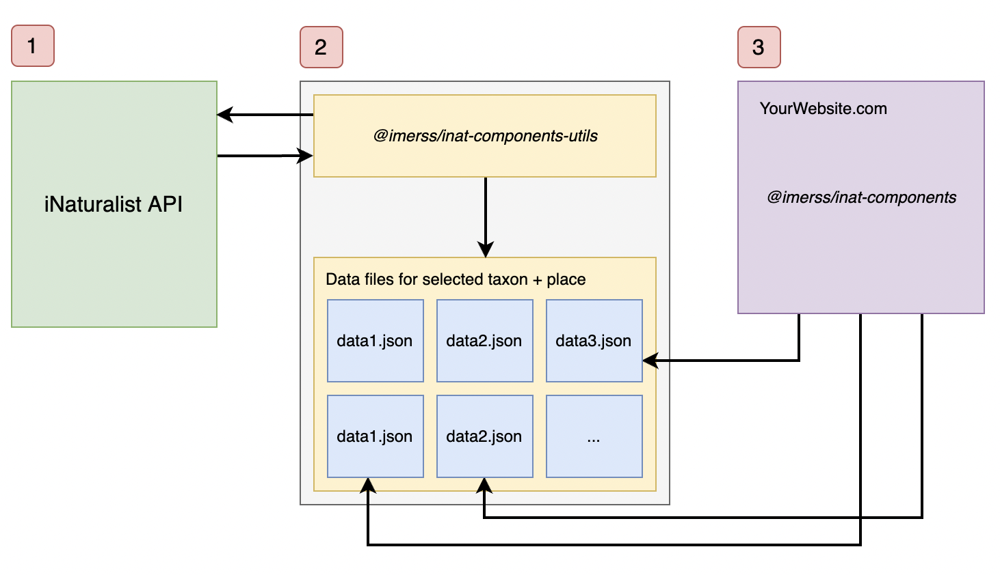

# inat-components

This repo contains some pre-built React components to display iNaturalist data on your own sites. The original goal was to
provide add an [interactive page to the BC Lepidoptera website](https://bcleps.weebly.com/inat.html) so visitors could 
see some high-level information about lepidoptera (butterflies and moths) spotted in British Columbia. But the code 
was written to allow it to be re-used by any website and for any taxon or place.

This repo stores both the components themselves (published to npm under `@imerss/inat-components`) and the backend
scripts to scrape iNat data and store it in JSON files for use by the front-end components (`@imerss/inat-components-utils`).
See below for an explanation of why that's necessary.

You have a choice with the front-end components to displa

### Demo

Simple: https://imerss.github.io/inat-components/
Live example: https://bcleps.weebly.com/inat.html


### How it works

Consider the following diagram. 



1. iNaturalist contains all the of the data about observations, taxonomy, observers and so on. They kindly offer a 
[public API](https://api.inaturalist.org/v1/docs/) (Application Programming Interface) to allow developers to request
data programmatically. The inat-components repo relies on that API to request the data that you need.
2. In between the iNat API and your own website is a script (`@imerss/inat-components-utils`) that does the job of calling
iNat and storing the data your want into separate data files. This code can run wherever you want - your own website 
is probably the most convenient. But wherever it is, it has to put the data files in a place that can be called by a
website. *
3. The front-end code running on your website then makes requests to the data files. They are created to be as small 
as possible and contain the smallest amount of info you need so the requests should be fast.

_Why the need for #2? Why not just call the iNat API from your own website?_ A couple of reasons: 
1. It's slow. Each API request has to do a lot of work on their end to retrieve the information. Also, the response will
contain a ton of information you don't need. 
iNaturalist caps the number of times you can make requests to their server per second, so they would be likely to shut down
your access to their API.


### Installation

To use the components, just use npm, pnpm or yarn - whatever you happen to be using for your package managed. 

```
npm install @imerss/inat-components
pnpm install @imerss/inat-components
yarn add @imerss/inat-components
```


### Features:

- Written in Typescript with typings for components and interfaces.
- Generic. Can display information for any taxon and any place.
- Three choices of data source:
    1. feed JSON data to components via prop (requires you to generate the data)
    2. ping an external cached data source (recommended - this lib contains a tool to generate that data for you)
    3. ping iNaturalist API directly (not recommended, but handy for local development)
- Default styling provided, but you can override anything you want.
- Option to customize the labels of the various components, plus overwrite the loader.


### Available components

We'll go into details about each of these components below, but here's what's available.

`<TaxonPanel />`

This is a pre-built panel containing all visualization data available, grouped into tabs: recent observations, common
taxa, favourites and a summary tab. You get less control using this component than all the others below, but it means
you don't have to write any code.

`<RecentObservations />`

This component shows a grid of recent observations made within a particular taxon. Since the purpose of this is to
show _recent_ sightings, you'll want the data source refreshed fairly frequently, e.g. every 10 or 15 minutes.

`<CommonTaxa />`

This component shows a grid of the most common taxa within a particular taxon, place and time period, e.g. the most
common beetles spotted in Canada in the current year.

`<Favourites />`

This component shows a grid of the most common taxa within a particular taxon, place and time period, e.g. the most
common beetles spotted in Canada in the current year.

`<Summary />`

This shows a high-level summary of the selected taxon and place. It shows information such as total number of
observations, total number of observers, a histogram of data observations per month, top observers, total number of
species and observation/species counts of the next taxonomical sub-level, e.g. if you specified an Order as the primary
taxon ID, it would provide family-level stats (Kingdom -> Phylum -> Class -> Order -> Family -> Genus -> Species).


## Changelog

#### @imerss/inat-components
 
- `1.1.2` - Aug 6th 2022, initial version.

#### @imerss/inat-components-utils

- `1.1.2` - Aug 6th 2022, initial version.
